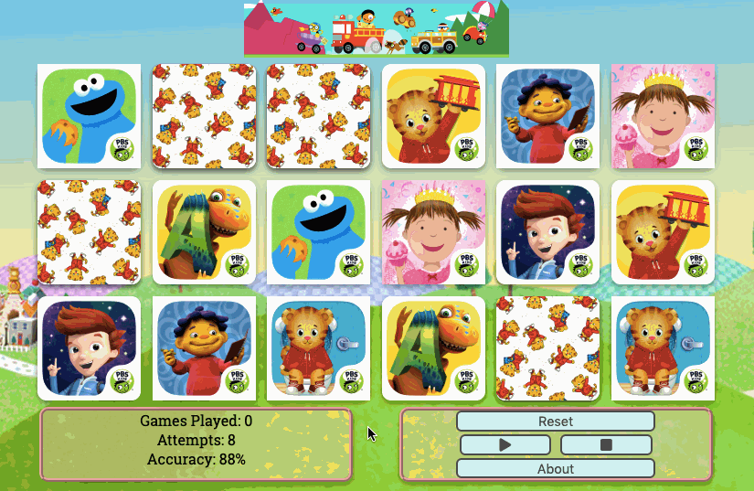

# Jed's Match

<hr/>
A memory-matching card game suitable for children to play that I built for my son, Jed. Users are able to click to match pairs of cards with live updating statistics.

## Getting Started
### Initial Setup
1. Fork this repo and clone your fork from the terminal.
```
$ git clone https://github.com/[user_name]/jeds_match.git
```
2. Navigate to and open the ```/jeds_match``` directory.
3. Open the ```index.html``` file and enjoy! 😃

## Contributing
Please feel free to fork this repo, make changes, submit pull requests, and send suggestions to billyhkim.dev@gmail.com to make this app better.

## Built With
* [JavaScript](https://www.ecma-international.org/publications/standards/Ecma-262.htm)
* [jQuery](https://jquery.com/)
* HTML
* CSS
* OOP Format

## License
[MIT License](https://opensource.org/licenses/mit-license.php)

[](https://opensource.org/licenses/mit-license.php)